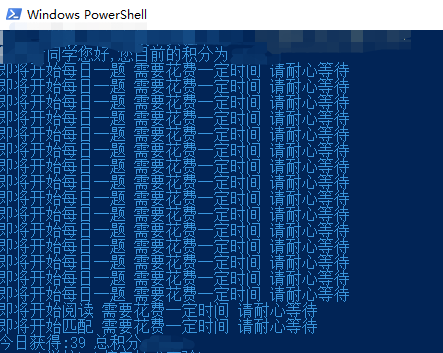

# jdsd-no-limit
利用GitHub工作流每天定时执行无限制版经典诵读

新建一个私人仓库（private），然后import code这个仓库 https://github.com/shehuiniwangge/jdsd-no-limit.git 的代码

将key放到config.json里面即可（没有简单的方法获取key值，只能抓包了，可以找会的同学帮忙

开启仓库的actions功能，每天8:30会自动执行一次

**开启邮件通知：**

去个人设置的Notifications，把Actions的Only notify for failed workflows取消掉，这样每次运行之后都会发一封邮件到你的邮箱，如果有failed的就是key值过期了，都是succeeded就不用担心了

想看分数建议是通过actions模块去查看每次执行记录，都会输出每次的分数，尽量不要通过手机点开小程序，可能会引起key值变动

每天可以获取的分数随机，最低为30

